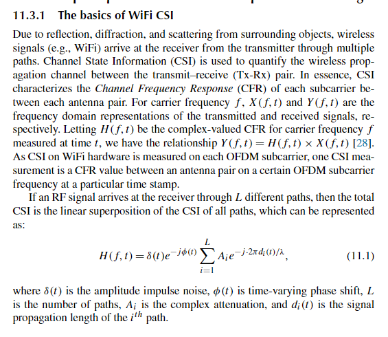
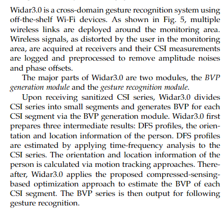
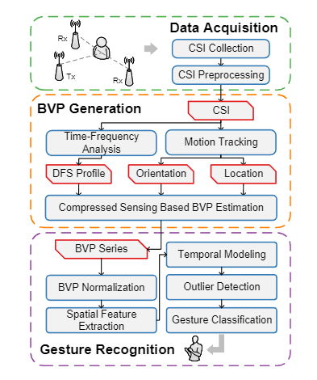

### 什么是 WIFI CSI

CSI 全称叫做 信道状态信息(Channel State Information)。 它记录和表征了通信信道从发送端到接收端的各种状态信息。 由于周围物体的反射、衍射,散射，无线信号经过多个路径从发送端到达接收端， CSI 用来量化发送与接收端之间的无线传播信道。 **本质上，CSI 表征了每对天线之间每个子载波的信道频率响应(CFR)**。 [1]

> 这里需要补充一点，需要做的工作是获取 CSI 数据，根据 CSI 数据进行深度学习。 通过 CSI 数据的变化来判断人体手势变化。 所以工作的重点不在于 CSI 数据所代表的通信知识，而是获取到 CSI 数据后的利用。 所以这里对 CSI 数据以及背后的通信知识做一个简单了解即可 (个人理解)

#### 名词解释

- 载波(carrier) : 指的是承载信息的信号波。
- CFR(信道频率响应) : 信号的多径传播在时域上表现为时延扩展，信道的冲击响应通常就代表了这信息。信道的这些影响在频域上带来的影响是选择性衰。直观上看这是由于信道中有不同延时的路径，通过不同路径的信号在接收端叠加增强或相消，使不同的频率的信号发生不同的衰减。 [2]
- OFDM(正交频分复用) : 是一种多载波调制技术，优点是：有效对抗频率选择性衰落，克服信号符号间的干扰。

### 如何收集 WIFI CSI 数据

能够收集 CSI 数据的方式有很多种.[3] [4]

#### Widar3 Dataset

使用现有数据集是最快，最简单的方法。 [5]
下载链接: http://tns.thss.tsinghua.edu.cn/widar3.0/
该数据集主要由三部分组成 CSI 文件夹、DFS 文件夹、BVP 文件夹。 Widar3.0 是一个使用现成 Wi-Fi 设备的跨域手势识别系统。如图 5 所示，监控区域周围部署了多条无线链路。接收器采集监测区域中用户造成的无线信号失真，并记录其 CSI 测量结果并进行预处理，以消除幅度噪声和相位偏移。 Widar3.0 的主要部分是两个模块，BVP 生成模块和手势识别模块。 Widar3.0 收到清理后的 CSI 系列后，将 CSI 系列分成小段，并通过 BVP 生成模块为每个 CSI 段生成 BVP。 Widar3.0 首先准备三个中间结果：DFS 轮廓、人的方向和位置信息。 DFS 配置文件是通过对 CSI 系列应用时频分析来估计的。通过运动跟踪方法计算人的方向和位置信息。此后，Widar3.0 应用所提出的基于压缩感知的优化方法来估计每个 CSI 段的 BVP。然后输出 BVP 系列用于后续手势识别。

##### 概念解释

DFS(Doppler frequency shift) : 是 CSI 的一个物理特征，叫做多普勒频率偏移
BVP( body-coordinate ve-locity profile) : 描述了不同速度下的功率分布，其中身体部位参与手势运动。

#### [PicoScenes Platform](https://ps.zpj.io/)

是一个中间件, 可以适配多种型号的硬件网卡并且通过统一的 API 提供给上层，帮助分析 CSI 数据。[3]
适配的硬件有：[6]

<table class="table" id="id6">
    <caption>
        CSI-Extractable Hardware Supported by The PicoScenes Platform
        
        <a class="headerlink" href="#id6" title="Link to this table">#</a>
    </caption>
    <colgroup>
    <col style="width: 9.1%">
    <col style="width: 18.2%">
    <col style="width: 18.2%">
    <col style="width: 18.2%">
    <col style="width: 18.2%">
    <col style="width: 18.2%">
    </colgroup>
    <thead>
        <tr class="row-odd"><th class="head stub">
Hardware Model
</th>
            <th class="head">
USRP-based SDR (X410 as example)
</th>
            <th class="head">
HackRF One
</th>
            <th class="head">
AX210/AX200
</th>
            <th class="head">
QCA9300
</th>
            <th class="head">
IWL5300
</th>
        </tr>
    </thead>
    <tbody>
        <tr class="row-even"><th class="stub">
Type
</th>
            <td>
SDR
</td>
            <td>
SDR
</td>
            <td>
Wi-Fi NIC
</td>
            <td>
Wi-Fi NIC
</td>
        <td>
Wi-Fi NIC
</td>
        </tr>
        <tr class="row-odd"><th class="stub">
Connection
</th>
<td>
USB 3.0 or 1/10/100 GbE
</td>
<td>
USB 2.0
</td>
<td>
M.2 2230
</td>
<td>
Mini PCI-E 1x
</td>
<td>
Mini PCI-E 1x
</td>
</tr>
<tr class="row-even"><th class="stub">
Supported Formats for CSI Measurement
</th>
<td>
802.11a/g/n/ac/ax/<strong>be</strong>
</td>
<td>
802.11a/g/n/ac/ax/<strong>be</strong>
</td>
<td>
802.11a/g/n/ac/ax
</td>
<td>
802.11n
</td>
<td>
802.11n
</td>
</tr>
<tr class="row-odd"><th class="stub">
Rx AGC
</th>
<td>
No, automatic by USRP B210
</td>
<td>
No
</td>
<td>
Yes, only automatic
</td>
<td>
Yes, has manual mode
</td>
<td>
Yes, only automatic
</td>
</tr>
<tr class="row-even"><th class="stub">
Available Carrier Frequency Range (MHz)
</th>
<td>
<strong>Arbitrary tunable in [1, 7200] MHz</strong>
</td>
<td>
<strong>Arbitrary tunable in [10, 7250] MHz</strong>
</td>
<td>
AX200: 2.4/5 GHz Bands, 470 MHz in total; <strong>AX210</strong>: 2.4/5/<strong>6</strong> GHz bands (<strong>[5955, 7115] MHz in 6GB)</strong>
</td>
<td>
<strong>Arbitrary tunable in [2.2-2.9] and [4.4-6.1] GHz</strong>
</td>
<td>
2.4/5 GHz Bands, 470 MHz in total
</td>
</tr>
<tr class="row-odd"><th class="stub">
Available Bandwidths (MHz)
</th>
<td>
<strong>tunable in [1, 400], scalable to 1600</strong> <a class="footnote-reference brackets" href="#id4" id="id1" role="doc-noteref">[1]</a>
</td>
<td>
<strong>Arbitrary tunable in [1, 20]</strong>
</td>
<td>
20/40/80/<strong>160</strong>
</td>
<td>
<strong>Arbitrary tunable in [2.5, 80]</strong>
</td>
<td>
20/40
</td>
</tr>
<tr class="row-even"><th class="stub">
Maximal MIMO Streams
</th>
<td>
4
</td>
<td>
1
</td>
<td>
2
</td>
<td>
3
</td>
<td>
3
</td>
</tr>
<tr class="row-odd"><th class="stub">
Maximal CSI dimension
</th>
<td>
<strong>1992x1x1, Scalable to 1992x4x4 streams</strong>
</td>
<td>
242x1x1
</td>
<td>
<strong>1992x2x2</strong>
</td>
<td>
114x3x3
</td>
<td>
30x3x3
</td>
</tr>
<tr class="row-even"><th class="stub">
Number of CSI per packet
</th>
<td>
<strong>Up to 39</strong> <a class="footnote-reference brackets" href="#id5" id="id2" role="doc-noteref">[2]</a>
</td>
<td>
<strong>Up to 39</strong> <a class="footnote-reference brackets" href="#id5" id="id3" role="doc-noteref">[2]</a>
</td>
<td>
1
</td>
<td>
<strong>2, by HT-rate Extra Spatial Sounding (ESS)</strong>
</td>
<td>
<strong>2, by HT-rate Extra Spatial Sounding (ESS)</strong>
</td>
</tr>
<tr class="row-odd"><th class="stub">
CSI Measurement for the Overheard Frames in Monitor Mode
</th>
<td>
<strong>YES</strong>, all-format (a/g/n/ac/ax/<strong>be</strong>), all-CBW (20/40/80/160/320 MHz), all-coding(LDPC/BCC)
</td>
<td>
<strong>YES</strong>, all-format (a/g/n/ac/ax/<strong>be</strong>), 20 MHz CBW, all-coding(LDPC/BCC)
</td>
<td>
<strong>YES</strong>
</td>
<td>
No, only for 11n sounding frames
</td>
<td>
No, only for the special 12:34:56 address
</td>
</tr>
<tr class="row-even"><th class="stub">
Packet Injection Support
</th>
<td>
<strong>Yes</strong>, all-format (a/g/n/ac/ax/<strong>be</strong>), all-CBW (20/40/80/160/320 MHz), all-coding(LDPC/BCC)
</td>
<td>
<strong>Yes</strong>, all-format (a/g/n/ac/ax/<strong>be</strong>), , all-CBW (20/40/80/160/320 MHz), all-coding(LDPC/BCC)
</td>
<td>
<strong>Yes</strong>, all-format (a/g/n/ac/<strong>ax</strong>), sub-320 CBW (20/40/80/160 MHz),  all-coding (LDPC/BCC)
</td>
<td>
Yes, a/g/n
</td>
<td>
Yes, a/g/n
</td>
</tr>
</tbody>
</table>

#### [Intel 5300 NIC CSI Tool](https://dhalperi.github.io/linux-80211n-csitool/)
该 CSI 工具 基于 Intel WiFi Wireless Link 5300 802.11n MIMO 无线电构建，使用修改后的固件和开源 Linux无线驱动程序。 它包括所有软件和收集、读取和解析 CSI 所需的脚本。IWL5300 提供 30 个子载波组的 802.11n CSI。 每组包含 2 个相邻的给定 20 MHz 带宽的子载波或给定 40 MHz 带宽的 4 个子载波。 每个 CSI 样本都是一个复杂的数字，实部和虚部均具有带符号的 8 位分辨率。 一条 CSI 记录是 𝐴×30矩阵，其中𝑀是发射和接收天线对的数量。可以访问该工具的主页4以获取详细信息 [3]

#### [Atheros CSI Tool](https://wands.sg/research/wifi/AtherosCSI/)
该工具包与Intel 5300 NIC CSI Tool类似，不过Atheros系列是开源的，不像Intel是闭源项目。 其基本方式是类似的。
#### [ESP32 CSI Toolkit](https://stevenmhernandez.github.io/ESP32-CSI-Tool/)
ESP32 CSI 工具包让研究人员可以直接从 ESP32 微控制器访问通道状态信息 (CSI)。使用该工具包闪存的 ESP32 可以从任何计算机、智能手机甚至独立设备提供在线 CSI 处理。这些功能加上 ESP32 的小尺寸，使研究人员能够以新的方式执行 Wi-Fi 传感和 CSI 定位等任务。所有这些都不需要复杂的固件破解。 与上面两种方法对比，更加的简单方便。
### 基于 WIFI CSI 数据的手势识别

#### 知识点

#### 实现步骤及手段

### references

[1] WIFI CSI-based vital signs monitoring
[2] https://iot-book.github.io/
[3] Hands-on Wireless Sensing with Wi-Fi A Tutorial
[4] https://iot-book.github.io/17_WiFi%E6%84%9F%E7%9F%A5/S1_%E4%BF%A1%E9%81%93%E7%8A%B6%E6%80%81%E4%BF%A1%E6%81%AF%E8%8E%B7%E5%8F%96/
[5] TPAMI_Widar3.0_paper.pdf
[6] https://ps.zpj.io/